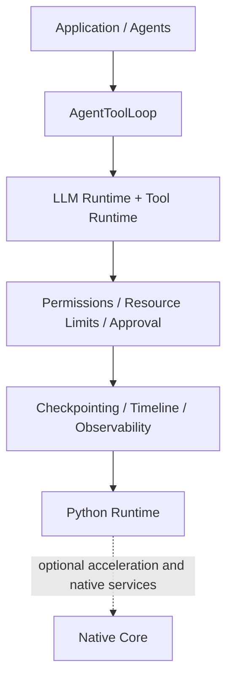

# Sulcus OS

Sulcus OS is a pre-v1 agent runtime for building restart-safe, observable workflows with process-like agents, registered tools, approvals, permissions, and bounded execution.

Agent libraries are good at describing what an agent should do. Sulcus exists to make the execution around that agent explicit: who owns it, which tools it may call, when a human must approve, what limits apply, what happened, and how a paused run can survive a restart. It is runtime infrastructure rather than a prompt, chain, graph, or multi-agent framework.

## Try the flagship demo

The Supervised Research Team is deterministic, offline, and Python-only. It plans work, runs registered research tools, recovers from a controlled failure, reviews evidence, and pauses for approval before simulated publication.

```powershell
python -m pip install -e .
sulcus demo research-team
```

Publication is denied by default. Add `--parallel`, `--tight-limits`,
`--approve-publish`, or `--show-timeline` to expose individual controls. See the
[flagship demo guide](examples/supervised_research_team/README.md).

## Quick install

Sulcus is currently installed from source and is not published to PyPI. Python
3.10 or newer is supported.

```powershell
py -m venv .venv
.\.venv\Scripts\Activate.ps1
python -m pip install -e .
sulcus --version
sulcus check
python examples\public_api_quickstart.py
```

The base install is Python-only and has no mandatory LLM SDK, dashboard, or
Rust dependency. Optional extras are documented in
[Installation](docs/installation.md). Start with the copy-paste
[10-minute quickstart](docs/quickstart.md).

## What Sulcus provides

- `AgentProcess` and supervisor trees for process-like ownership and restart policy.
- Structured request/reply IPC with validation, correlation, priorities, expiry, and bounded mailboxes.
- A provider-neutral LLM runtime with a deterministic offline provider and an optional OpenAI-compatible adapter.
- `ToolRegistry` and `ToolRuntime`: tools execute only after explicit registration and argument validation.
- `AgentToolLoop`: bounded LLM → tool → LLM orchestration with sequential or safe parallel execution modes.
- Permission policies, per-loop/per-round/per-tool limits, post-execution timeout checks, and resumable approval.
- Versioned persistent approval checkpoints that can be inspected and resumed with a reconstructed compatible runtime.
- Structured runtime events, safe timeline metadata, and an optional interactive dashboard.

Sulcus is useful when an agent workflow needs explicit execution controls,
supervision, auditability, or restart-safe human approval. It is probably not
needed for a single stateless model call or when a framework's in-memory chain
execution is sufficient.

## Architecture at a glance



Applications should import from `agentos` and its documented public submodules.
Modules under `kernel.*` are internal implementation and carry no external
compatibility guarantee. See the [architecture guide](docs/architecture.md) for
the process model, IPC, tool loop, approval lifecycle, checkpoints, events, and
Rust/Python boundary.

## Python-only and native-backed execution

| Capability | Python-only | Native core required |
| --- | :---: | :---: |
| Public imports, configuration, and CLI diagnostics | ✓ | |
| Deterministic or provider-backed LLM runtime | ✓ | |
| Tool registry/runtime and `AgentToolLoop` | ✓ | |
| Permissions, limits, approval, and persistent checkpoints | ✓ | |
| Flagship research-team demo | ✓ | |
| Structured IPC message types and `AgentProcess` authoring API | ✓ | |
| Bundled interactive dashboard runtime | | ✓ |
| Native bounded mailbox transport and kernel registry | | ✓ |
| Native memory primitives and WASM sandbox | | ✓ |

`sulcus check` reports the active capabilities. Python-only mode is a supported
development path, not an error state. Build the optional `agent_os_core`
extension with `maturin develop` only when using native-backed features.

## How Sulcus differs from agent frameworks

Frameworks such as LangGraph, CrewAI, and AutoGen primarily help applications
compose agent behavior, conversations, roles, or workflow graphs. Sulcus focuses
on the runtime boundary around such behavior: process-like ownership,
supervision and restart policy, registered tool execution, permissions, limits,
approval, runtime events, and restart-safe checkpoints. These concerns can be
complementary; Sulcus does not claim API compatibility, feature parity, or
performance superiority over those projects.

## Documentation

- [Documentation index](docs/README.md)
- [10-minute quickstart](docs/quickstart.md)
- [Architecture](docs/architecture.md)
- [Concepts](docs/concepts.md)
- [Public API and stability](docs/public_api.md)
- [Configuration](docs/configuration.md)
- [Persistent checkpoints](docs/checkpoints.md)
- [Examples by purpose](docs/examples.md)
- [Troubleshooting](docs/troubleshooting.md)

## Maturity and limitations

Sulcus is alpha-quality, pre-v1 software. The intended stable surface is the
top-level `agentos` package plus `agentos.runtime`, `agentos.tools`,
`agentos.ipc`, and `agentos.native`. `agentos.llm` is an advanced public API
that may evolve with documented migration guidance. `kernel.*` is internal.

Current checkpoints are local version-1 JSON files: they contain sensitive
workflow data, require the caller to reconstruct compatible tools and runtimes,
and provide no encryption, signature, migration framework, distributed lock,
or cross-host consumption ledger. Synchronous tool timeouts are checked after a
call returns; they do not interrupt Python execution. The deterministic demos
exercise runtime behavior with scripted providers and bundled data; they do not
measure model quality or prove production readiness. Sulcus does not yet provide
a production-grade distributed runtime.

See [Public API](docs/public_api.md) and [Roadmap](docs/roadmap.md) for the
stability boundary and current direction.

## Development

```powershell
python -m pip install -e .[dev]
python -m pytest
python scripts\verify_package.py
```

Native development is optional:

```powershell
python -m pip install -e .[native-dev]
maturin develop
cargo check
```

## License status

**No open-source license has been granted.** Package metadata declares
`LicenseRef-Unlicensed`. The repository is source-visible, but you must not
assume rights to use, copy, modify, or redistribute it beyond applicable law or
an explicit grant from the owner.
