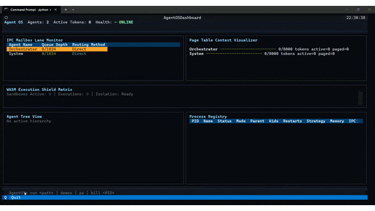

# Agent OS
Python 3.14 | Rust Core | 83+ Tests Passing | Active Development

An experimental runtime for hierarchical multi-agent systems featuring supervision, IPC, memory paging, fault tolerance, and an interactive dashboard.

<p align="center">
  
</p>

A lightweight hybrid runtime that combines:

- A Rust core crate (`agent_os_core`)
- Python orchestration (`main.py`, `kernel/`)
- Optional WASM sandboxed execution for constrained agent code

## Try the demos

Launch the interactive Agent OS dashboard:

```powershell
python main.py
```

Then use the dashboard shell:

```text
AgentOS> demos
AgentOS> run examples/research_team
AgentOS> run demos/supervisor_recovery
AgentOS> run demos/memory_paging
```

| Demo | Command | Demonstrates |
|---|---|---|
| Research Team | `run examples/research_team` | Multi-agent workflow orchestration, IPC flow, and agent hierarchy visualization |
| Supervisor Recovery | `run demos/supervisor_recovery` | Child termination detection, supervisor restart, and fault tolerance |
| Memory Paging | `run demos/memory_paging` | Context/page allocation visualization |

The dashboard visualizes the Agent Tree View, IPC Mailbox Lane Monitor,
Process Registry, workflow or recovery status, and WASM isolation status.

## Project Structure

- `src/` Rust crate source
- `kernel/` Python runtime modules (processes, dashboard, toolchain, LLM integration)
- `tests/` Test suite
- `examples/` Example assets/configurations
- `docs/` Documentation
- `main.py` Python entrypoint
- `Cargo.toml` Rust crate config

## Documentation

- `docs/sdk_quickstart.md` is the 15-minute developer guide for writing agents.
- `docs/interactive_shell.md` covers the process shell and isolation modes.
- `docs/ipc_protocol.md` covers the structured Agent-to-Agent IPC protocol.
- `docs/supervision.md` covers supervisor trees and restart policies.
- `docs/persistent_memory.md` covers tiered persistent memory paging.

## External agents preview

v0.7 begins support for running user-provided agents through an `agentos.toml`
manifest. Inspect a project from the Agent OS dashboard shell:

```text
AgentOS> inspect ./examples/external_basic_agent
AgentOS> run ./examples/external_basic_agent
```

v0.7 currently supports inspecting and running local Python `basic` agents only.

## Requirements

- Python 3.10+
- Rust (stable toolchain)
- Cargo

## Quick Start

For Windows test/development setup, see `docs/windows_dev_setup.md`.

### 1) Python environment

```powershell
py -3.14 -m venv .venv
.\.venv\Scripts\Activate.ps1
python -m pip install -U pip
pip install -r requirements-dev.txt
```

Install the native Python extension into the active virtual environment:

```powershell
maturin develop
```

### 2) Build Rust core

```powershell
cargo build
```

### 3) Run runtime

```powershell
python main.py
```

## Development

Run tests:

```powershell
python -m pytest
```

Run Rust checks:

```powershell
$env:PYO3_PYTHON = ".\.venv\Scripts\python.exe"
cargo check
```

## Self-Healing Multi-Agent Demo

Start the dashboard with `python main.py`, then run:

```text
run examples/agent_os_demo_supervisor.py
ps
```

The demo supervisor launches a coordinator, a persistent-memory agent, an
isolated worker, and an isolated crash probe. The coordinator exercises
structured request/reply IPC, records recalled cold memory, intentionally
crashes the probe, and verifies the restarted replacement. Keep the dashboard
open to watch child PIDs, restart counts, mailbox counters, and paged memory.

For a finite headless smoke run that prints the same telemetry as JSON:

```powershell
python -m examples.run_agent_os_demo
```

## Research Team Demo

Run the deterministic multi-agent research showcase:

```powershell
python -m examples.research_team.research_team
```

It demonstrates typed IPC contracts, planner fan-out, research fan-in,
synthesis, and critic review without API keys or external services. See
`examples/research_team/README.md` for the architecture and expected output.

## Supervisor Recovery Demo

From the Agent OS dashboard shell, run:

```text
AgentOS> run demos/supervisor_recovery
```

This deterministic dashboard demo shows basic fault tolerance:

```text
child termination -> supervisor detection -> automatic restart
```

### Agent Tree View

Visualizes supervisor-to-agent relationships for active workflows.

## Notes

- Runtime behavior is configurable through environment variables used in `main.py`.
- Logs are written to files such as `agent_runtime.log` and `agent_debug.log`.

### Structured runtime events

Agent OS emits structured runtime events for dashboard observability. These
events power future filtering, metrics, replay, and debugging features.

### Runtime timeline

The dashboard includes a chronological Runtime Timeline view for structured
events, with compact lifecycle and metadata summaries.

### Agent metrics

Step 20 added an Agent Metrics Panel for compact per-agent runtime health and
activity inspection, building on structured runtime events and the runtime timeline.
