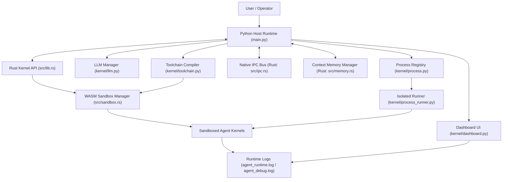

# Architecture Diagram

## Runtime Boundaries

- Host orchestration: Python (`main.py`, `kernel/`)
- Performance-critical + sandbox internals: Rust (`src/`)
- Execution isolation: WASM sandbox and optional process isolation

## Key Data Flows

1. User input enters `main.py`.
2. Python host routes work to LLM/toolchain and process manager.
3. Rust core provides IPC, memory, and sandbox primitives.
4. Compiled/validated agent code runs inside WASM sandbox.
5. Results and telemetry flow to dashboard and logs.
