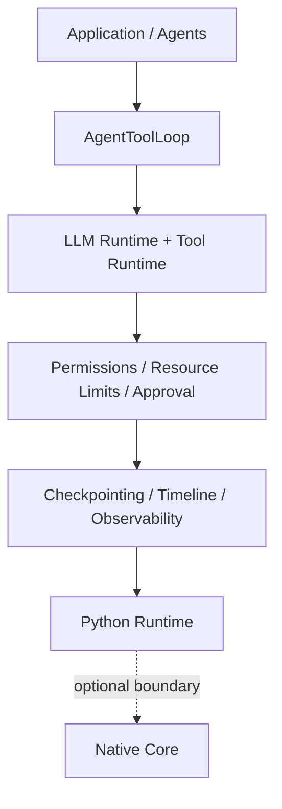
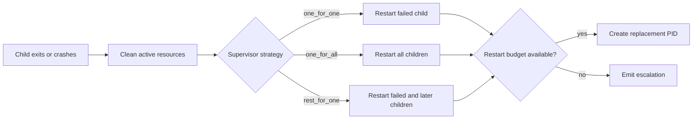

# Architecture

Sulcus OS is a runtime layer for controlled agent execution. Applications own
their prompts, domain logic, and tools; Sulcus owns the boundaries around
execution: registration, validation, supervision, approval, limits,
checkpointing, and runtime signals.

## Layer model



The arrows describe responsibility, not a mandatory call stack. For example,
an application may use `ToolRuntime` directly without an `AgentToolLoop`, or
use the process/IPC APIs without an LLM.

## Major components

| Layer | Responsibility | Public entry point |
| --- | --- | --- |
| Application / agents | Domain code, prompts, agent classes, approval decisions | Application code; `agentos.AgentProcess` |
| Agent tool loop | Bounded LLM → tool → LLM rounds | `agentos.runtime.AgentToolLoop` |
| LLM runtime | Provider-neutral requests, routing, retries, budgets, caching, streaming, and optional cost accounting | `agentos.llm` (advanced) |
| Tool runtime | Explicit registration, schema validation, execution, and safe results | `agentos.tools` |
| Execution controls | Tool allow/deny policy, call limits, execution mode, and approval gates | `agentos.runtime` |
| Persistence | Versioned approval checkpoints and compatibility validation | `agentos.checkpoints` |
| Configuration | Optional project defaults and environment/explicit precedence | `agentos.config` |
| Native services | Bounded mailbox transport, native registry/memory primitives, and WASM execution | Capability checks through `agentos.native` |

## Agent processes and supervision

`AgentProcess` is the authoring model for a long-running actor with lifecycle
hooks and a mailbox. A process registry attaches the agent to runtime services,
allocates a PID, tracks state, and owns cleanup. Agents can run as trusted
`asyncio` tasks or in spawned Python child processes. Spawned-process mode
reduces accidental state sharing, but it is not a complete security sandbox.

Supervisors form parent/child trees. The registry detects termination and
applies the child's restart policy (`permanent`, `transient`, or `temporary`)
under the parent's strategy:



Restart counts are bounded within a time window, optional backoff is applied,
and terminal records remain observable after active resources are removed. The
full bundled process host and dashboard compose these Python policies with
native services.

## IPC

Sulcus IPC is a structured JSON protocol over a mailbox transport. Envelopes
carry message and correlation IDs, source and target PIDs, message type,
priority, timestamp, optional expiry, and payload. Request/reply helpers retain
correlation IDs. Validation rejects malformed, oversized, expired, or
unroutable messages with structured error codes.

Trusted agents route through the host registry. Isolated agents use
`multiprocessing` queues to bridge serialized envelopes back through that same
host authority. In the bundled full runtime, `agent_os_core.NativeIPCBus`
provides bounded native mailboxes and immediate backpressure signals.

The protocol models and helpers in `agentos.ipc` are Python-only. Running the
complete native-backed IPC host requires `agent_os_core`.

## LLM abstraction

`LLMRuntime` consumes provider-neutral messages and returns `LLMResponse`.
Providers implement a small completion interface; optional interfaces add
streaming. The runtime can apply routing/fallback, retry rules, known-usage
budgets, response caching, and user-supplied cost rates without coupling the
tool runtime to one vendor.

`DeterministicLLMProvider` supports offline development. The
`OpenAICompatibleProvider` loads the optional `openai` dependency only when it
is used. `LLMRuntime.chat()` may return tool-call requests, but it never
executes them by itself.

## Tool execution and the agent tool loop

Tools must be registered by name with a description, parameter schema, and
callable. `ToolRuntime` validates a call against that registry and returns a
structured result. Sulcus does not discover Python functions by model-provided
name and does not provide shell, filesystem, or network tools by default.

`AgentToolLoop` explicitly connects the LLM and tool runtimes:

```mermaid
sequenceDiagram
    participant App as Application
    participant Loop as AgentToolLoop
    participant LLM as LLMRuntime
    participant Guard as Policy / Limits / Approval
    participant Tool as ToolRuntime

    App->>Loop: run(messages, registered definitions)
    Loop->>LLM: chat(history, tools)
    LLM-->>Loop: response with tool calls
    Loop->>Guard: preflight each requested call
    alt approval required
        Guard-->>App: checkpoint + safe pending metadata
        App->>Loop: resume(checkpoint, decisions)
    end
    Guard->>Tool: execute allowed call
    Tool-->>Loop: structured result
    Loop->>LLM: continue with tool result
    LLM-->>App: final response
```

The default loop is bounded to four steps, sequential, and stops on tool
errors. Parallel mode only executes registrations marked `parallel_safe`; the
older `allow_parallel_tool_calls` switch is not supported. Synchronous timeout
limits are measured after a callable returns and do not preempt Python code.

## Approval lifecycle

Approval is a pause/resume boundary, not a callback hidden inside tool
execution.

1. The LLM requests one or more registered tools.
2. Permissions and resource limits run before approval.
3. With approval enabled, the loop returns `reason="approval_required"`, safe
   `PendingToolApproval` metadata, and a checkpoint. No pending callable runs.
4. The application records an explicit approve/deny decision for every call.
5. Resume reuses the stored LLM response, executes only approved calls, and
   continues the loop. A denial becomes a sanitized tool result.

Partial decision sets remain paused and execute nothing. Approval reasons are
for the caller's audit trail and are not copied into runtime events or model
feedback.

## Persistent checkpoints

`agentos.checkpoints` serializes paused approval state as deterministic,
versioned UTF-8 JSON with a SHA-256 integrity digest. A fresh process must
reconstruct the provider, loop, registry, and callable implementations. Resume
validates stable tool names, descriptions, schemas, provider/model labels when
available, and execution safety settings.

A complete file-backed resume atomically renames the source to `.consumed`
before executing tools. Validation failure restores it; partial decisions leave
it untouched. Checkpoints contain message content, tool arguments, and previous
results, so they must be treated as sensitive application data. They are local
restart artifacts, not distributed workflow storage.

## Runtime events and observability

LLM, tool, and loop components accept an event sink and emit structured runtime
metadata for starts, completions, failures, routing, approvals, limits, and tool
execution. Safe event fields include names, counts, durations, provider/model
labels, and error categories. Prompts, tool argument values, credentials, raw
provider responses, and stack traces are not included by default.

The Python runtime can collect or forward those events without the native
extension. The interactive timeline, process tree, IPC monitor, memory views,
and other dashboard panels are part of the native-backed full runtime. Replay
and dependency views are observability aids; they do not schedule or alter live
execution.

## Python-only versus native-backed

Python-only mode supports configuration, public API imports, LLM providers,
registered tools, agent tool loops, permissions, limits, approval, persistent
checkpoints, and the flagship demo. Structured IPC values and `AgentProcess`
classes can also be authored and tested without loading the extension.

The bundled interactive runtime uses the optional PyO3 extension
`agent_os_core` for its native kernel registry, bounded IPC bus, native memory
primitive, and WASM sandbox. The dashboard additionally needs the `dashboard`
extra. Use `agentos.native.get_runtime_capabilities()` or `sulcus check`; do not
import `agent_os_core` directly from application code.

## Public and internal boundaries

The intended v1 public surface is:

- `agentos` for the compact process, IPC, tool-loop, and capability facade.
- `agentos.runtime`, `agentos.tools`, `agentos.ipc`, and `agentos.native` as the
  intended stable public submodules.
- `agentos.llm` as an advanced public integration API.
- `agentos.config` and `agentos.checkpoints` as documented workflow APIs.

`kernel.*`, `main.py`, and the raw `agent_os_core` module are implementation.
They remain importable because Sulcus itself uses them, but external code should
not depend on their compatibility. See [Public API](public_api.md).
